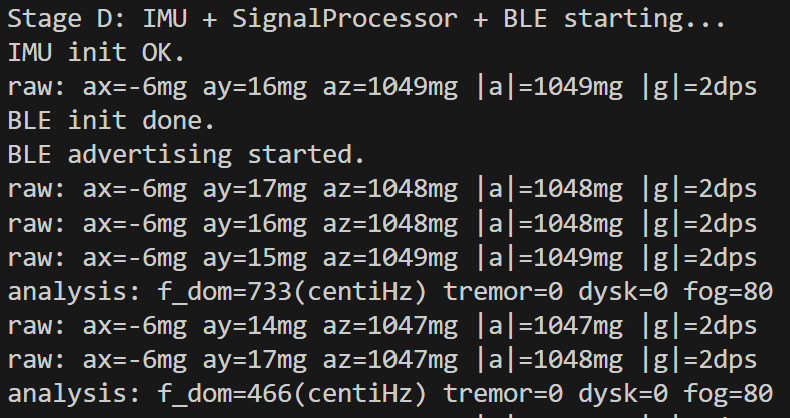
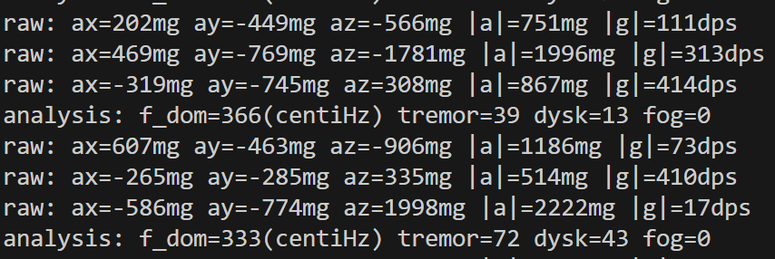
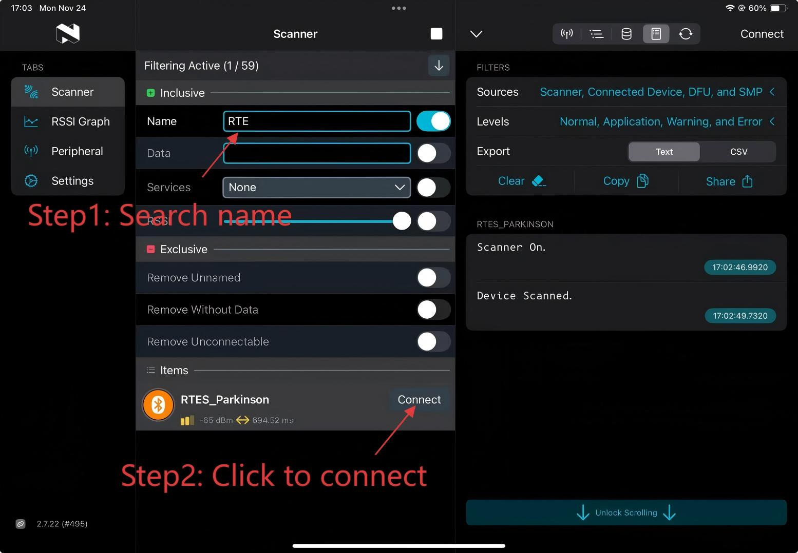
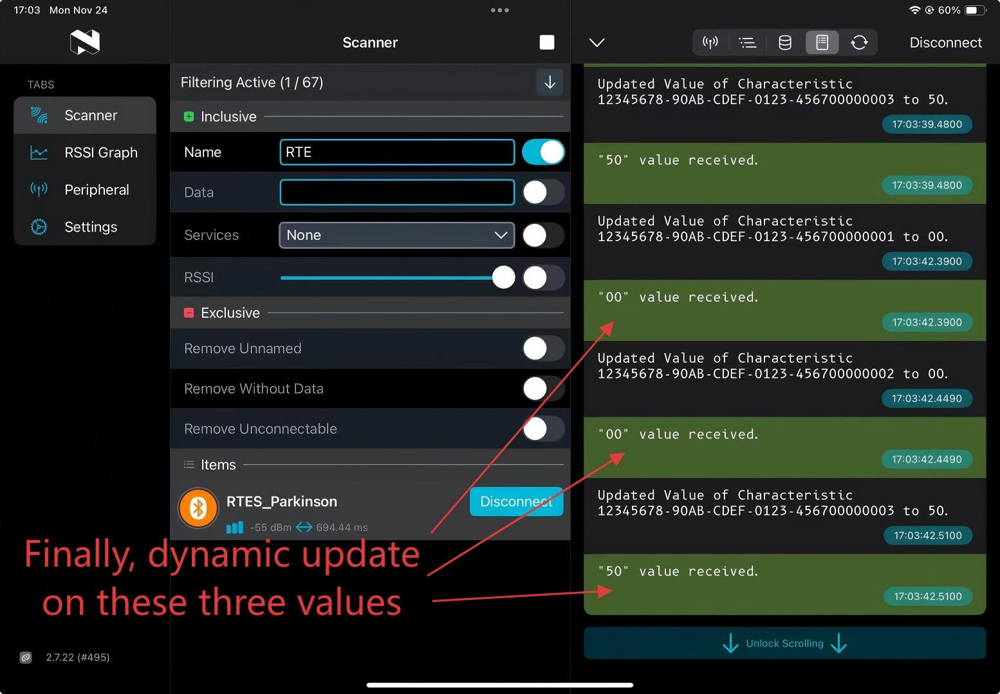

# RTES Parkinson Monitor – Progress Summary

## Current Progress

I have successfully implemented real-time monitoring and BLE transmission of the following three Parkinson-related movement indicators:

| Metric | Meaning | Behavior |
|--------|---------|-----------|
| **Tremor Level** | Measures shaking intensity | Increases when shaking the board |
| **Dyskinesia Level** | Measures irregular excessive motion | Rises with strong random movement |
| **FOG (Freezing of Gait) Level** | Detects sudden movement reduction after activity | High at rest, drops when moving |

All three values now update dynamically and are transmitted via BLE as three independent `Notify` characteristics.  
These values have been verified using **nRF Connect**, and correctly respond to motion changes. (Detailed operation method check the manual in the bottom.)

### My current output in monitor:
When the board is freezed, 
in raw, |a| is around 1000 and |g| is very small
in analysis, tremor and dysk are both 0 and fog is 80

When shaking the board,
in raw: |a| is fluctuated and |g| becomes large
in analysis, tremor and dysk becomes large and fog becomes 0

---

## Requirements Completed

According to the project requirements, the following items have been completed:

| Requirement | Status |
|-------------|--------|
| Real-time IMU data acquisition | ✔ Completed |
| Signal processing & symptom level calculation | ✔ Completed |
| BLE custom service with 3 characteristics | ✔ Completed |
| BLE mobile app test & live updating values | ✔ Completed |
| Distinguish between resting vs active movement | ✔ Verified |
| Stable system with no crashes | ✔ Confirmed |

---

## Next Steps

| Task | Purpose |
|-------|--------|
| Fine-tune tremor / dyskinesia / FOG threshold parameters | Improve accuracy based on real data （I have commented TODO in the code） |
| Record 1-minute demo video | Required for submission |
| Plot curves of levels over time (for documentation) | Show detection performance visually |
| Add creativity features (LED color patterns / button reset) | Improve usability & earn creativity credit |

## Manual on how to use the nRF Connect App
### Download application: nrf connect for mobile 

